# Architecture Documentation: Nuxt Layer-Based Design

## Table of Contents

- [Overview](#overview)
- [Core Principles](#core-principles)
- [Layer Structure](#layer-structure)
- [Layer Communication Patterns](#layer-communication-patterns)
- [Store Architecture (Elm Pattern)](#store-architecture-elm-pattern)
- [Schema-Driven Development](#schema-driven-development)
- [Layer Configuration](#layer-configuration)
- [Linting & Architecture Enforcement](#linting--architecture-enforcement)
- [When to Create a New Layer](#when-to-create-a-new-layer)
- [Example: Adding New Layer](#example-adding-new-layer)
- [Layer Dependency Graph](#layer-dependency-graph)
- [Testing Layers](#testing-layers)
- [Migration Guide](#migration-guide)
- [Common Pitfalls](#common-pitfalls)
- [Best Practices Checklist](#best-practices-checklist)
- [Resources](#resources)

## Overview

This Nuxt 4 app uses **layer-based architecture** to organize code by business features. Each layer is self-contained with its own components, stores, schemas, and utilities. Layers provide natural boundaries for separation of concerns.

## Core Principles

### 1. Feature Isolation
Each layer represents a distinct business domain:
- **shared**: Reusable UI components and utilities (no business logic)
- **products**: Product catalog, filtering, and display
- **cart**: Shopping cart with persistence and calculations

### 2. Dependency Flow (Unidirectional)


**Rules:**
- Layers can only depend on `shared` layer
- Cart layer can import schemas from products layer (data contracts only)
- Layers cannot import from each other (except shared)
- Main app can import from any layer
- No circular dependencies allowed

### 3. Explicit Imports Only
Auto-imports are **disabled** for code clarity:
- All Vue/Nuxt composables must be explicitly imported
- All components must be manually imported
- Better IDE support and refactoring safety

## Layer Structure

### Physical Directory Layout

```
layers/
├── shared/          # Foundation layer (no business logic)
│   ├── nuxt.config.ts
│   └── app/
│       ├── components/
│       │   └── baseBadge.vue
│       └── utils/
│           ├── currency.ts
│           └── storage.ts
│
├── products/        # Product domain
│   ├── nuxt.config.ts
│   └── app/
│       ├── components/
│       │   ├── productCard.vue
│       │   ├── productFilters.vue
│       │   └── productGrid.vue
│       ├── pages/
│       │   ├── (home)/
│       │   │   └── index.vue
│       │   └── products/
│       │       └── [id].vue
│       ├── schemas/
│       │   ├── product.ts
│       │   └── filters.ts
│       ├── stores/
│       │   └── products/
│       │       ├── products.ts        # Pinia integration
│       │       ├── productsModel.ts   # State type definitions
│       │       ├── productsUpdate.ts  # Pure reducers
│       │       └── productsEffects.ts # Side effects (API calls)
│       └── utils/
│           └── filters.ts
│
└── cart/            # Shopping cart domain
    ├── nuxt.config.ts
    └── app/
        ├── components/
        │   ├── cartItem.vue
        │   ├── cartList.vue
        │   └── cartSummary.vue
        ├── pages/
        │   └── shoppingCart.vue
        ├── schemas/
        │   └── cart.ts
        ├── stores/
        │   └── cart/
        │       ├── cart.ts           # Pinia integration
        │       ├── cartModel.ts      # State type definitions
        │       ├── cartUpdate.ts     # Pure reducers
        │       └── cartEffects.ts    # Side effects (localStorage)
        └── utils/
            └── calculations.ts
```

### Layer Architecture Diagram

```mermaid
graph TB
    subgraph "Layer Hierarchy (Bottom → Top)"
        direction TB
        L1[Shared Layer<br/>UI components, utilities]
        L2[Products Layer<br/>Catalog management]
        L3[Cart Layer<br/>Shopping cart]
        L4[Main App<br/>Pages, global config]
    end

    L4 -.imports.-> L3
    L4 -.imports.-> L2
    L4 -.imports.-> L1
    L3 -.imports.-> L1
    L2 -.imports.-> L1
    L3 -.schemas only.-> L2

    style L1 fill:#d4edda
    style L2 fill:#fff3cd
    style L3 fill:#f8d7da
    style L4 fill:#e1f5ff
```



## Layer Communication Patterns

### Import Paths

Nuxt provides special aliases for layer imports:

```typescript
// ✅ Importing from shared layer
import { formatCurrency } from '#layers/shared/app/utils/currency'
import BaseBadge from '#layers/shared/app/components/baseBadge.vue'

// ✅ Importing schemas from products layer (data contracts)
import { ProductSchema } from '#layers/products/app/schemas/product'

// ✅ Importing from same layer
import { filterProducts } from '../../utils/filters'

// ❌ WRONG: Importing business logic across layers
import { useProductsStore } from '#layers/products/app/stores/products/products'
```

### Data Flow Diagram


## Store Architecture (Elm Pattern)

Each layer's store follows **The Elm Architecture** for predictable state management:


### Store File Structure

Each store is split into 4 files:

1. **`{feature}.ts`** - Pinia integration (reactive layer)
2. **`{feature}Model.ts`** - State type definitions and initial state
3. **`{feature}Update.ts`** - Pure reducer functions (no side effects)
4. **`{feature}Effects.ts`** - Side effects (API calls, localStorage)

**Example: Cart Store**

```typescript
// cartModel.ts - State definition
export interface CartModel {
  items: CartItem[]
}

export type CartMsg =
  | { type: 'ADD_ITEM'; product: Product; quantity: number }
  | { type: 'REMOVE_ITEM'; productId: string }

export const initialModel: CartModel = { items: [] }

// cartUpdate.ts - Pure reducer (testable, no side effects)
export function update(model: CartModel, msg: CartMsg): CartModel {
  switch (msg.type) {
    case 'ADD_ITEM':
      // Return new state (immutable)
      return { ...model, items: [...model.items, newItem] }
    default:
      return model
  }
}

// cartEffects.ts - Side effects
export function saveCartToStorage(items: CartItem[]) {
  setItem('cart', items)
}

// cart.ts - Pinia integration
export const useCartStore = defineStore('cart', () => {
  const model = ref<CartModel>(initialModel)

  function dispatch(msg: CartMsg) {
    model.value = update(model.value, msg) // Pure update
  }

  watch(() => model.value.items, saveCartToStorage) // Effect

  return { state: readonly(model), dispatch }
})
```

**Benefits:**
- ✅ Pure functions are easily testable
- ✅ All state changes go through single dispatch point
- ✅ Side effects isolated and explicit
- ✅ Time-travel debugging possible
- ✅ State immutability enforced

## Schema-Driven Development

### Validation with Zod

All data contracts use **Zod schemas** for runtime validation:


**Schema Locations:**
- `layers/shared/schemas/` - None (shared has no business logic)
- `layers/products/app/schemas/` - Product, ProductCategory, Filters
- `layers/cart/app/schemas/` - CartItem, Cart

**Usage:**
```typescript
// Define schema
export const ProductSchema = z.object({
  id: z.string().min(1),
  name: z.string().min(1).max(200),
  price: z.number().int().positive(),
})

export type Product = z.infer<typeof ProductSchema>

// Validate data
const result = ProductSchema.safeParse(externalData)
if (result.success) {
  // TypeScript knows this is valid Product
  const product = result.data
}
```

**Cross-Layer Schema Imports:**
- Cart layer imports `ProductSchema` from products layer
- Only schema imports allowed (data contracts, not business logic)

## Layer Configuration

Each layer has `nuxt.config.ts`:

```typescript
export default defineNuxtConfig({
  $meta: {
    name: 'products',
    description: 'Products feature with catalog, filtering, and sorting',
  },

  components: {
    dirs: [], // Auto-imports disabled
  },

  imports: {
    autoImport: false, // Explicit imports only
  },
})
```

Layers are auto-registered by Nuxt from `layers/` directory.

## Linting & Architecture Enforcement

### Dual-Linting Setup

```mermaid
graph LR
    A[Source Code] --> B[Oxlint<br/>Fast checks]
    B --> C{Pass?}
    C -->|Yes| D[ESLint<br/>Custom rules]
    C -->|No| E[Fix errors]
    D --> F{Pass?}
    F -->|Yes| G[✅ Code OK]
    F -->|No| E

    style B fill:#d4edda
    style D fill:#fff3cd
    style G fill:#d4edda
    style E fill:#f8d7da
```



**Oxlint (Primary - Speed):**
- `.oxlintrc.json` - Single source of truth
- 50-100x faster than ESLint
- Correctness, suspicious patterns, style checks
- Type-aware linting (experimental)

**ESLint (Secondary - Custom Rules):**
- `eslint.config.mjs` - Vue component rules, complexity checks
- `vue/no-undef-components` - Critical (catches missing imports)
- Architecture boundary rules commented (layers enforce naturally)

### Layer Boundaries

**Natural Enforcement:**
```typescript
// ❌ This won't work - layers can't import from each other
import { useProductsStore } from '#layers/products/...'
// Error: Cannot find module (Nuxt layer isolation)

// ✅ Only shared layer is accessible
import { formatCurrency } from '#layers/shared/...'
```

Nuxt layers **naturally prevent** cross-layer imports. No ESLint rules needed!

## When to Create a New Layer

### Decision Tree


### Create New Layer When:

✅ **Distinct Business Domain**
- Feature has its own data models, business rules
- Example: User authentication, payment processing, notifications

✅ **Independent State Management**
- Needs its own Pinia store
- State not shared with other features
- Example: Wishlist, order history, reviews

✅ **Has Own Pages/Routes**
- Feature includes dedicated pages
- Example: User profile (`/profile`), checkout flow (`/checkout`)

✅ **Clear Boundaries**
- Can define public API (components, composables)
- Minimal coupling to other layers
- Example: Analytics layer, comments system

### Add to Existing Layer When:

⚠️ **Extends Current Domain**
- Adds functionality to existing feature
- Example: Add sorting to products → products layer

⚠️ **Shares State**
- Needs access to existing store
- Example: Product reviews might extend products layer

### Add to Shared Layer When:

💡 **Pure UI Components**
- No business logic
- Reusable across features
- Example: Button, Badge, Modal

💡 **Utility Functions**
- Generic helpers (formatting, validation)
- No feature-specific logic
- Example: Date formatting, array helpers

### Anti-Patterns (Don't Create Layer For):

❌ **Single Component**
- Too granular, adds complexity
- Put in appropriate feature layer

❌ **Tightly Coupled Features**
- If two layers need to call each other's stores
- Consider merging or restructuring

❌ **Shared Business Logic**
- If multiple layers need same logic
- Move to shared utilities or rethink domain boundaries

## Example: Adding New Layer

**Scenario:** Add user authentication

### 1. Create Layer Structure

```bash
mkdir -p layers/auth/app/{components,composables,pages,schemas,stores/auth,utils}
```

### 2. Add Layer Config

```typescript
// layers/auth/nuxt.config.ts
export default defineNuxtConfig({
  $meta: {
    name: 'auth',
    description: 'User authentication and authorization',
  },

  components: { dirs: [] },
  imports: { autoImport: false },
})
```

### 3. Define Schema

```typescript
// layers/auth/app/schemas/user.ts
import { z } from 'zod'

export const UserSchema = z.object({
  id: z.string().min(1),
  email: z.string().email(),
  name: z.string().min(1),
  role: z.enum(['user', 'admin']),
})

export type User = z.infer<typeof UserSchema>
```

### 4. Create Store (Elm Pattern)

```typescript
// layers/auth/app/stores/auth/authModel.ts
export interface AuthModel {
  user: User | null
  loading: boolean
  error: string | null
}

export type AuthMsg =
  | { type: 'LOGIN_START' }
  | { type: 'LOGIN_SUCCESS'; user: User }
  | { type: 'LOGIN_ERROR'; error: string }
  | { type: 'LOGOUT' }

export const initialModel: AuthModel = {
  user: null,
  loading: false,
  error: null,
}

// layers/auth/app/stores/auth/authUpdate.ts
export function update(model: AuthModel, msg: AuthMsg): AuthModel {
  switch (msg.type) {
    case 'LOGIN_START':
      return { ...model, loading: true, error: null }
    case 'LOGIN_SUCCESS':
      return { ...model, user: msg.user, loading: false }
    case 'LOGIN_ERROR':
      return { ...model, error: msg.error, loading: false }
    case 'LOGOUT':
      return initialModel
    default:
      return model
  }
}

// layers/auth/app/stores/auth/authEffects.ts
export async function login(
  email: string,
  password: string,
  dispatch: (msg: AuthMsg) => void
) {
  dispatch({ type: 'LOGIN_START' })

  try {
    const user = await $fetch('/api/auth/login', {
      method: 'POST',
      body: { email, password },
    })

    const validated = UserSchema.parse(user)
    dispatch({ type: 'LOGIN_SUCCESS', user: validated })
  } catch (error) {
    dispatch({ type: 'LOGIN_ERROR', error: String(error) })
  }
}

// layers/auth/app/stores/auth/auth.ts
import { defineStore } from 'pinia'
import { ref, computed, readonly } from 'vue'

export const useAuthStore = defineStore('auth', () => {
  const model = ref<AuthModel>(initialModel)

  function dispatch(msg: AuthMsg) {
    model.value = update(model.value, msg)
  }

  const user = computed(() => model.value.user)
  const isAuthenticated = computed(() => model.value.user !== null)
  const loading = computed(() => model.value.loading)

  return {
    state: readonly({ user, isAuthenticated, loading }),
    dispatch,
    login: (email: string, password: string) => login(email, password, dispatch),
    logout: () => dispatch({ type: 'LOGOUT' }),
  }
})
```

### 5. Add Components

```vue
<!-- layers/auth/app/components/loginForm.vue -->
<script setup lang="ts">
import { ref } from 'vue'
import { UCard, UButton, UInput } from '#components'
import { useAuthStore } from '../stores/auth/auth'

const authStore = useAuthStore()
const email = ref('')
const password = ref('')

async function handleSubmit() {
  await authStore.login(email.value, password.value)
}
</script>

<template>
  <UCard>
    <form @submit.prevent="handleSubmit">
      <UInput v-model="email" type="email" placeholder="Email" />
      <UInput v-model="password" type="password" placeholder="Password" />
      <UButton type="submit" :loading="authStore.state.isAuthenticated">
        Login
      </UButton>
    </form>
  </UCard>
</template>
```

### 6. Add Pages

```vue
<!-- layers/auth/app/pages/login.vue -->
<script setup lang="ts">
import LoginForm from '../components/loginForm.vue'
</script>

<template>
  <div class="min-h-screen flex items-center justify-center">
    <LoginForm />
  </div>
</template>
```

### 7. Use in Other Layers

```vue
<!-- layers/cart/app/pages/checkout.vue -->
<script setup lang="ts">
import { useAuthStore } from '#layers/auth/app/stores/auth/auth'
import { useRouter } from 'vue-router'
import { computed } from 'vue'

const authStore = useAuthStore()
const router = useRouter()

// Protect route
const isAuthenticated = computed(() => authStore.state.isAuthenticated)

if (!isAuthenticated.value) {
  router.push('/login')
}
</script>
```

## Layer Dependency Graph

```mermaid
graph TD
    subgraph "Current Layers"
        SHARED[Shared Layer<br/>✓ Components: baseBadge<br/>✓ Utils: currency, storage]
        PRODUCTS[Products Layer<br/>✓ Store: products<br/>✓ Pages: home, product detail<br/>✓ Schemas: Product, Filters]
        CART[Cart Layer<br/>✓ Store: cart<br/>✓ Pages: shopping cart<br/>✓ Schemas: CartItem]
    end

    subgraph "Future Layers (Examples)"
        AUTH[Auth Layer<br/>○ Store: auth<br/>○ Pages: login, register<br/>○ Schemas: User]
        ORDERS[Orders Layer<br/>○ Store: orders<br/>○ Pages: order history<br/>○ Schemas: Order]
        REVIEWS[Reviews Layer<br/>○ Store: reviews<br/>○ Components: reviewList<br/>○ Schemas: Review]
    end

    PRODUCTS --> SHARED
    CART --> SHARED
    CART -.schemas.-> PRODUCTS

    AUTH --> SHARED
    ORDERS --> SHARED
    ORDERS -.schemas.-> AUTH
    ORDERS -.schemas.-> PRODUCTS
    REVIEWS --> SHARED
    REVIEWS -.schemas.-> PRODUCTS
    REVIEWS -.schemas.-> AUTH

    style SHARED fill:#d4edda
    style PRODUCTS fill:#fff3cd
    style CART fill:#f8d7da
    style AUTH fill:#e1f5ff,stroke-dasharray: 5 5
    style ORDERS fill:#e1f5ff,stroke-dasharray: 5 5
    style REVIEWS fill:#e1f5ff,stroke-dasharray: 5 5
```



## Testing Layers

### Unit Testing Stores

Pure `update` functions are easily testable:

```typescript
// layers/cart/app/stores/cart/__tests__/cartUpdate.test.ts
import { describe, it, expect } from 'vitest'
import { update } from '../cartUpdate'
import { initialModel } from '../cartModel'

describe('Cart Update', () => {
  it('adds item to cart', () => {
    const msg = {
      type: 'ADD_ITEM' as const,
      product: mockProduct,
      quantity: 1
    }

    const newModel = update(initialModel, msg)

    expect(newModel.items).toHaveLength(1)
    expect(newModel.items[0].product.id).toBe(mockProduct.id)
  })
})
```

### Integration Testing Components

```typescript
// layers/products/app/components/__tests__/productCard.test.ts
import { mount } from '@vue/test-utils'
import ProductCard from '../productCard.vue'

describe('ProductCard', () => {
  it('displays product info', () => {
    const wrapper = mount(ProductCard, {
      props: { product: mockProduct }
    })

    expect(wrapper.text()).toContain(mockProduct.name)
  })
})
```

## Migration Guide

### From Monolithic to Layers

**Before (Monolithic):**
```
app/
├── components/
│   ├── productCard.vue
│   ├── cartItem.vue
│   └── baseBadge.vue
├── stores/
│   ├── products.ts
│   └── cart.ts
└── pages/
    ├── index.vue
    └── cart.vue
```

**After (Layered):**
```
layers/
├── shared/app/components/baseBadge.vue
├── products/app/
│   ├── components/productCard.vue
│   └── stores/products/
└── cart/app/
    ├── components/cartItem.vue
    └── stores/cart/
```

**Steps:**
1. Identify business domains
2. Create layer directories
3. Move files to appropriate layers
4. Update imports to use `#layers/...` aliases
5. Extract shared code to shared layer
6. Add Zod schemas for validation
7. Refactor stores to Elm pattern (optional but recommended)

## Common Pitfalls

### 1. Over-Layering
**Problem:** Creating too many tiny layers
**Solution:** Start with broader domains, split when complexity grows

### 2. Circular Dependencies
**Problem:** Layer A imports from Layer B, which imports from Layer A
**Solution:** Extract shared code to shared layer or rethink boundaries

### 3. Leaking Implementation Details
**Problem:** Exposing internal store structure
**Solution:** Only export readonly state and dispatch function

### 4. Skipping Validation
**Problem:** Trusting external data (localStorage, API)
**Solution:** Always validate with Zod schemas at boundaries

### 5. Mixing Concerns
**Problem:** Putting business logic in shared layer
**Solution:** Shared layer = UI + utilities only, no domain logic

## Best Practices Checklist

### For Each Layer:

- [ ] Has clear business domain
- [ ] Has `nuxt.config.ts` with metadata
- [ ] Uses explicit imports (auto-imports disabled)
- [ ] Defines Zod schemas in `schemas/`
- [ ] Follows Elm pattern for stores (model/update/effects split)
- [ ] Components in `components/`
- [ ] Pages in `pages/` (if needed)
- [ ] Pure utilities in `utils/`
- [ ] Only imports from shared layer (except schemas)

### For Store Files:

- [ ] `{feature}Model.ts` - State types, message types, initial state
- [ ] `{feature}Update.ts` - Pure reducer functions
- [ ] `{feature}Effects.ts` - Side effects (API, localStorage)
- [ ] `{feature}.ts` - Pinia integration with readonly state

### For Components:

- [ ] Uses `<script setup lang="ts">`
- [ ] Explicit imports for all dependencies
- [ ] Props and emits with TypeScript types
- [ ] No direct store mutations (use dispatch)

## Helpful Commands

```bash
# Lint all layers
pnpm lint

# Run development server
pnpm dev

# Type check
pnpm typecheck

# Build for production
pnpm build

# Create new layer structure
mkdir -p layers/{name}/app/{components,pages,schemas,stores/{name},utils}
touch layers/{name}/nuxt.config.ts
```

## Resources

- [Nuxt Layers Documentation](https://nuxt.com/docs/guide/going-further/layers)
- [Pinia Stores](https://pinia.vuejs.org)
- [Zod Validation](https://zod.dev)
- [The Elm Architecture](https://guide.elm-lang.org/architecture/)
- [Vue Composition API](https://vuejs.org/guide/extras/composition-api-faq.html)

## Summary

**Key Takeaways:**

1. **Layers = Business Domains**: Each layer is a feature with clear boundaries
2. **Unidirectional Flow**: shared ← products ← cart ← main app
3. **Explicit Imports**: No magic, better refactoring, clearer dependencies
4. **Elm Pattern**: Predictable state via pure reducers + side effects
5. **Schema-Driven**: Zod validation at all boundaries
6. **Natural Enforcement**: Nuxt layers prevent cross-layer imports automatically

**When to Create New Layer:**
- Distinct business domain ✅
- Independent state ✅
- Has own pages/routes ✅
- Clear API boundaries ✅

**Add to Existing Layer:**
- Extends current feature ⚠️
- Shares state ⚠️

**Add to Shared Layer:**
- Pure UI components 💡
- Generic utilities 💡

This architecture scales from small projects to large enterprise apps while maintaining clear boundaries and testability.
